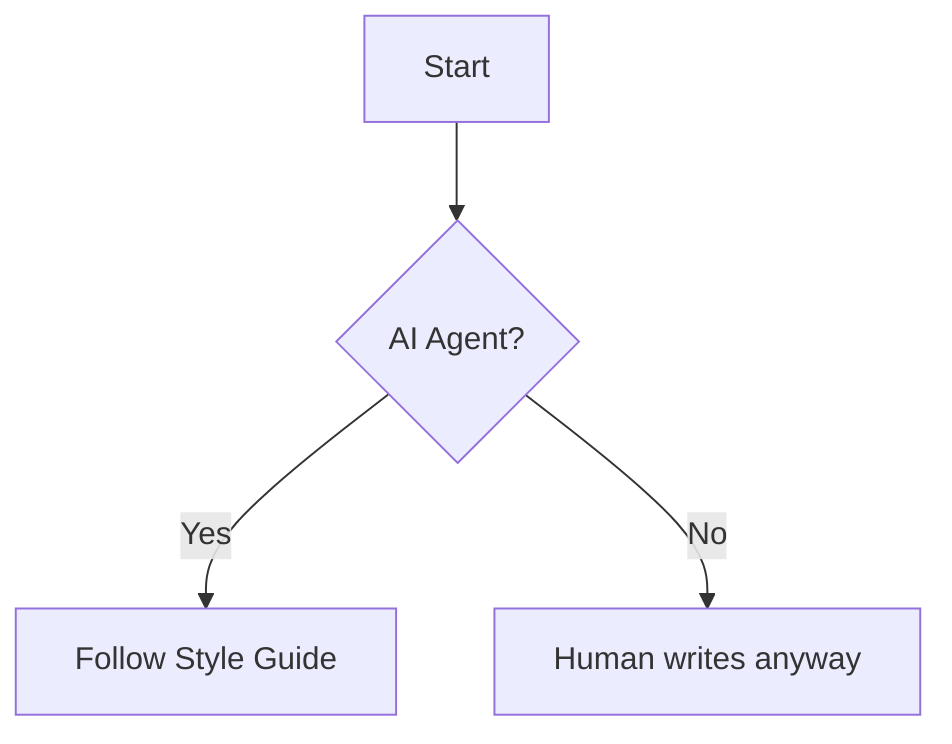

## Headings

### H3 Heading
{: .mt-4 .mb-0 }

## Typography

- **Bold** and _Italics_
- [Links](https://google.com)
- Inline code: `const x = 10;`
- Filepath: `/etc/hosts`{: .filepath}

## Prompts

> This is a tip prompt.
{: .prompt-tip }

> This is an info prompt.
{: .prompt-info }

> This is a warning prompt.
{: .prompt-warning }

> This is a danger prompt.
{: .prompt-danger }

## Media

{: w="700" h="400" .shadow }
_This is an image caption_

### Video Embed



## Code Blocks

```python
def hello_world():
    print("Follow the Chirpy style!")
```
{: file="hello.py" }

## Math

$$
\begin{equation}
  E = mc^2
\end{equation}
$$

## Mermaid


