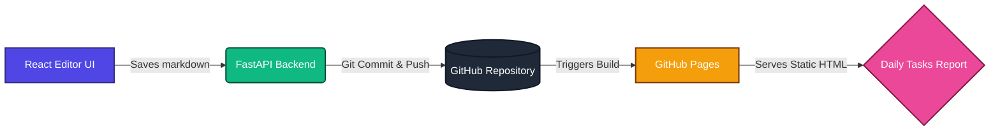

## Overview

Have you ever wanted to track your daily work effortlessly and have it automatically generate a clean, print-friendly report for your team, manager, or your own records? We built a system to do exactly that using a unified workflow between a custom editor and a GitHub Pages site.

This project connects an easy-to-use **Task Editor** with a **Static Report Page**. As soon as you log and save your tasks, they are instantly synced to a public (or password-protected) web page that formats them into a beautiful, chronological report. 



---

## Functionality

The workflow is split into two connected parts: the input channel and the presentation layer.

### 1. The Task Editor
The Editor App is a web interface (built with React and FastAPI) where you add, edit, or copy previous tasks. Think of this as your personal command center.

Here is a look at the daily input screen where you can add new rows, check off done items, and specify the status:


When you are done for the day, hitting the 'Save & Publish' button prompts a lock screen, preventing accidental pushes to the production branch:


### 2. The Daily Tasks Log
The Daily Tasks Log is a static web page hosted on GitHub Pages that reads your saved tasks and turns them into a polished report you can filter and print out. This is where your manager or auditor will go to view your progress.

To protect raw data from uninvited eyes, the report page comes with a client-side password gate. Visitors will see this screen first:


Once unlocked, the final cleaned and formatted report is displayed, allowing readers to see what you did, when you did it, and filter by specific date ranges:


---

## Features

This system comes packed with several quality-of-life additions specifically built for daily auditing:

- **Easy Task Entry:** A customizable table for each task. Mark them as Done, write a quick description, pick a status (like `in-progress`, `completed`, or `leave`), and add remarks.
- **Carry-over Tasks:** Didn't finish yesterday's task? A simple "**Copy to Today**" button moves incomplete tasks from past days to your current list.
- **Clean Layout:** The tasks are displayed chronologically from newest to oldest. Repetitive design elements are reduced to keep it clean and readable.
- **Filter by Date:** You can pick a "From" and "To" date, and the report will filter cleanly down to those days.
- **Print Ready:** Two special print buttons exist: **Print Current View** (just the dates you filtered) or **Print Full Report** (everything). 

---

## Setup & Running Locally

If you're a developer wanting to understand or run this yourself, the setup utilizes a split repository structure where the backend modifies a Markdown file directly on the static site.

The "source of truth" for all tasks is `daily_tasks_log.md` located in the static site repository.

#### 1) The Backend Server (FastAPI)
The backend manages the reading and saving of your tasks.
```bash
cd iphone_dashboard/backend
cp .env.example .env
python3 main.py
```
*Runs on `http://localhost:8000`*

#### 2) The Frontend Editor (React)
The UI where you type your tasks.
```bash
cd iphone_dashboard/frontend
npm install
npm run dev
```
*Runs on `http://localhost:5173`*

#### 3) The Static Site (Jekyll)
The blog/report page that displays the tasks.
```bash
cd kumarrajdevops.github.io
bundle install
bundle exec jekyll serve --livereload
```
*Runs on `http://127.0.0.1:4000/Daily_Tasks/`*

---

## Security

When replicating this project in production, keep the following security principles in mind:

- **Token Protection:** Never store your GitHub Token in the frontend React code. Always keep it in your backend server as an environment variable to prevent unauthorized repository access.
- **Convenience over Fortresses:** The password gate on the static site is handled via client-side JavaScript. This offers a quick, convenient barrier against casual visitors but is **not** true security against someone inspecting the HTML payload. For highly sensitive audits, use edge-server authentication or a private repository.

---

## Pros and Cons

**Pros:**
- **Markdown as a Database:** By using a simple Markdown file as your "database," the system is incredibly lightweight, there is absolutely zero money involved (no cloud DB costs or scaling fees), and data is extremely easy to recover or backup—just copy the text file!
- **Zero Cost Hosting:** Utilizing GitHub Pages and the free tier of a provider like Render minimizes infrastructure costs completely.
- **Audit Trails:** Because the data is saved as Markdown to GitHub, you get a full version history via Git commits. You can always see exactly what changed, when, and by whom!
- **Highly Portable:** Markdown is universal. You are never locked into a proprietary database for your task records.

**Cons:**
- **Delayed Rendering:** Syncing via a GitHub Actions pipeline means it takes roughly 30 to 60 seconds for a saved task to reflect on the live report page.
- **Limited Real-time Collaboration:** Due to Git-based sync, having multiple people edit the same day's Markdown file simultaneously could result in merge conflicts. It is best suited as a single-user reporting tool.

