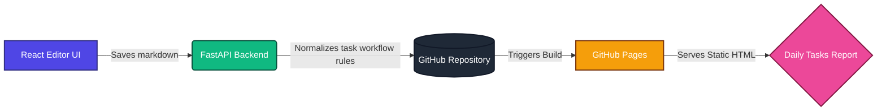

## Overview

This is the updated version of the daily task tracking workflow.  
It keeps the same architecture (React editor + FastAPI + GitHub Pages report), but now includes stricter status rules and better day-to-day editing ergonomics so tasks are not lost in carry-forward cycles.



---

## Functionality

### 1) Task Editor (Render/Local)

The editor supports:
- Add and edit date blocks in table format
- Copy incomplete rows from history to today
- Manage task states (`in-progress`, `completed`, `postponed`, `blocked`, `leave`, `weekoff`)
- Save and publish to markdown source

### 2) Static Daily Tasks Log

The static report page (`/Daily_Tasks/`) renders markdown into:
- Summary cards
- Date-wise grouped tables
- Date filters
- Pagination
- Print actions

---

## Latest Changes (25-Apr-2026)

### Workflow rule enforcement

Two important workflow rules are now enforced during save:

1. **Single active in-progress per task**
   - For the same task across multiple dates, only the latest remains `in-progress`.
   - Older active entries are converted to `postponed`.

2. **Auto carry-forward completion tracking**
   - If a task is marked `completed` on a later date, earlier `in-progress` entries are auto-converted to `postponed`.
   - Remark gets a trace note like:  
     `carry forwarded to next day; completed on DD/MM/YYYY`

These checks are implemented server-side in FastAPI before writing the markdown file, so behavior is consistent even if UI/client versions differ.

### Checkbox and status synchronization

Editor behavior now keeps `Done` and `Status` in sync:
- If status changes to `completed`, checkbox becomes checked.
- If checkbox is checked, status becomes `completed`.
- If unchecked from `completed`, status falls back to `in-progress`.

### History view improvements

- History blocks now render newest first.
- History focuses on actionable states and non-working context (`in-progress`, `blocked`, `leave`, `weekoff`).
- Missing date gaps can be surfaced as editable blocks so users can backfill work after emergency/offline periods.

### Summary accuracy on static page

The summary metric logic was corrected:
- `Done` now counts explicit `completed` status rows.
- `In-Progress` now counts explicit `in-progress` status rows.
- It no longer uses `total - done` (which incorrectly included `postponed`, `leave`, `weekoff`).

---

## Setup & Running Locally

#### 1) Backend (FastAPI)
```bash
cd iphone_dashboard/backend
cp .env.example .env
python3 main.py
```
Runs on `http://localhost:8000`

#### 2) Frontend (React + Vite)
```bash
cd iphone_dashboard/frontend
npm install
npm run dev
```
Runs on `http://localhost:5173`

#### 3) Static Site (Jekyll)
```bash
cd kumarrajdevops.github.io
bundle install
bundle exec jekyll serve
```
Runs on `http://127.0.0.1:4000/Daily_Tasks/`

---

## Security Notes

- Keep GitHub token only in backend environment variables.
- The static page password gate is client-side convenience, not strong security.
- For strict confidentiality, use private hosting and server-side authentication.

---

## Version Log

### v1.0 - 21-Apr-2026
- Initial daily tracker workflow published.
- Render editor + GitHub Pages report integration.
- Copy-to-today, filters, and print mode coverage.

### v1.1 - 25-Apr-2026
- Added save-time workflow normalization:
  - single active `in-progress` rule
  - auto carry-forward completion conversion
- Added checkbox/status bidirectional sync in editor.
- Improved history visibility and gap-day editing workflow.
- Fixed static report summary metric calculations.

---

## Pros and Cons (Updated)

**Pros**
- Lightweight markdown-first architecture
- Clear audit trail through Git history
- Better workflow consistency through server-side normalization
- Easier recovery and backfill for missed dates

**Cons**
- GitHub Pages publish latency still applies (typically 30–60s)
- Multi-user concurrent edits can still cause merge conflicts

