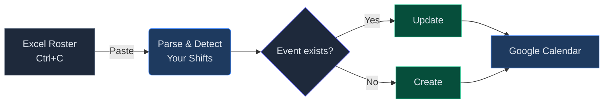

Every month I'd open the Excel roster, find my name, and manually create each shift in Google Calendar. 30+ days, three columns to check, 20 minutes gone. I finally got tired of it and built a small tool to do it for me.

> **Try it:** [Roster → Calendar](/roster-calendar/) — paste your roster, preview your shifts, sync to Google Calendar (or download an ICS file).
{: .prompt-tip }

---

## How It Works



You copy the roster table from Excel, paste it into the tool, and it figures out which shifts are yours. You get a preview, then choose to sync directly to Google Calendar or download an `.ics` file to import anywhere.

No app to install, no account to create, no server running anywhere.

---

## The Roster Format

The tool reads the standard 5-column roster format:


_Select any range in Excel including the header row, copy with Ctrl+C, and paste into the tool._

It handles all the usual variations — names with parentheses like `Kumar (Off)`, comma-separated names like `Kumar,Harishankar`, and **No Weekly Off** days.

---

## One-Time Google Setup

To sync directly to Google Calendar, you need a free OAuth Client ID from Google Cloud. This is a one-time setup.

1. Go to [console.cloud.google.com](https://console.cloud.google.com) and create a new project
2. Go to **APIs & Services → Library** and enable **Google Calendar API**
3. Go to **APIs & Services → Credentials → Create Credentials → OAuth 2.0 Client ID**
4. Set type to **Web application**
5. Under **Authorized JavaScript origins**, add your site URL (e.g. `https://yourdomain.github.io`)
6. Copy the Client ID, paste it into the **Configuration** section on the tool page, and click **Save**

> The Client ID is not a secret — it only works from the domains you listed in step 5.
{: .prompt-info }

---

## How to Use It

1. Open [Roster → Calendar](/roster-calendar/)
2. Select your roster in Excel (include the header row) → **Ctrl+C**
3. Click inside the paste area on the page → **Ctrl+V**
4. The tool shows a preview of your shifts with dates, times, and shift type
5. Uncheck any rows you want to skip
6. **Option A — Google Calendar:** click **Sign in with Google**, then **Sync Events**
7. **Option B — Any calendar app:** click **⬇ Download ICS**, then import the file

---

## What Gets Created

Each event is colour-coded and includes a description showing the full day's roster:

| | Shift 1 | Shift 2 | Weekly Off |
|---|---|---|---|
| **Time** | 8:30 AM – 5:30 PM | 11:30 AM – 8:30 PM | All day |
| **Color** | 🔵 Blue | 🟢 Green | 🔴 Red |
| **Reminder** | 30 min before | 30 min before | — |
| **Location** | Office | Office | — |

The event description always shows who's on each shift that day, so you can check at a glance without opening the roster:

```
🔵 Shift 1 (8:30 AM - 5:30 PM)  : Kumar  ← on duty
🟢 Shift 2 (11:30 AM - 8:30 PM) : Harishankar
🔴 Weekly Off                    : Pratik
```

If you paste the same roster again, it updates existing events instead of creating duplicates.

---

## Managing Events

The **Manage Calendar Events** section lets you fetch your existing roster events for any date range, review them in a table, and delete individual ones. There's also a one-click button to bulk-delete everything older than 2 months — useful for keeping your calendar tidy.

---

## What's Next

- **Team view** — show all team members' shifts in one calendar, each in a different colour
- **Configurable shift times** — let you set the start/end times from the UI rather than hardcoding them
